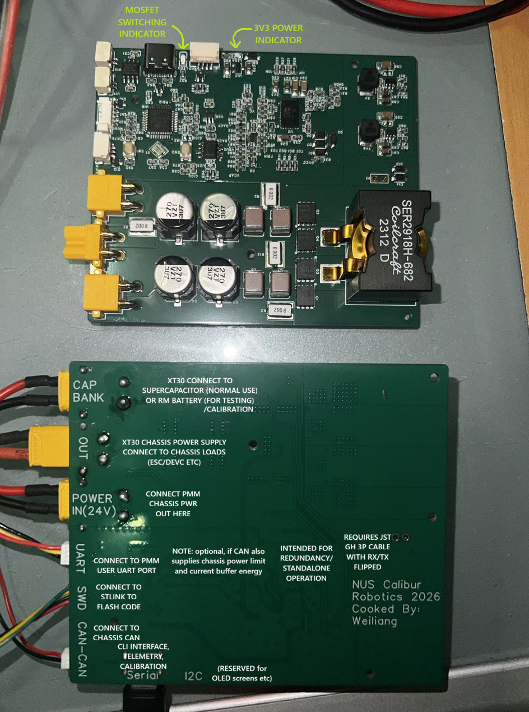
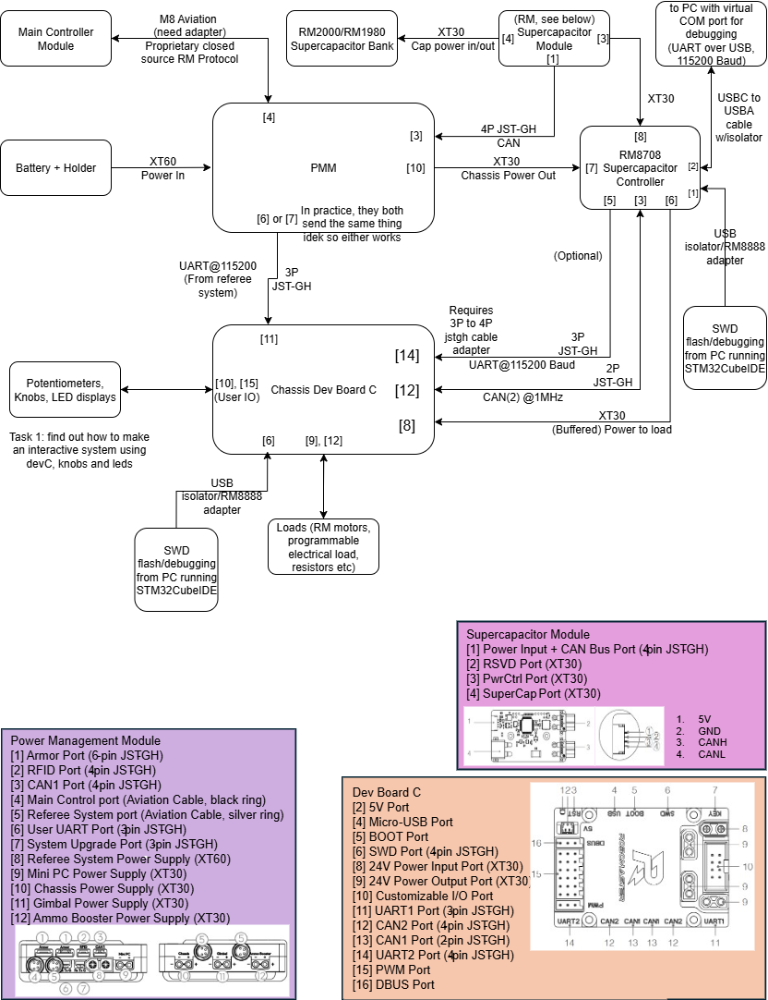
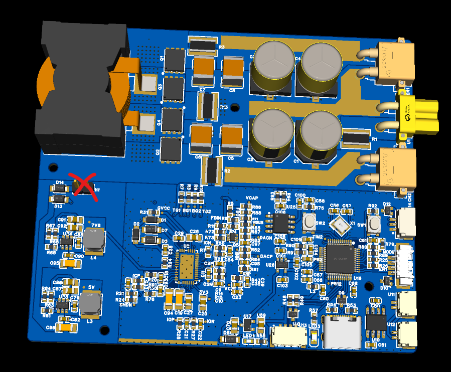
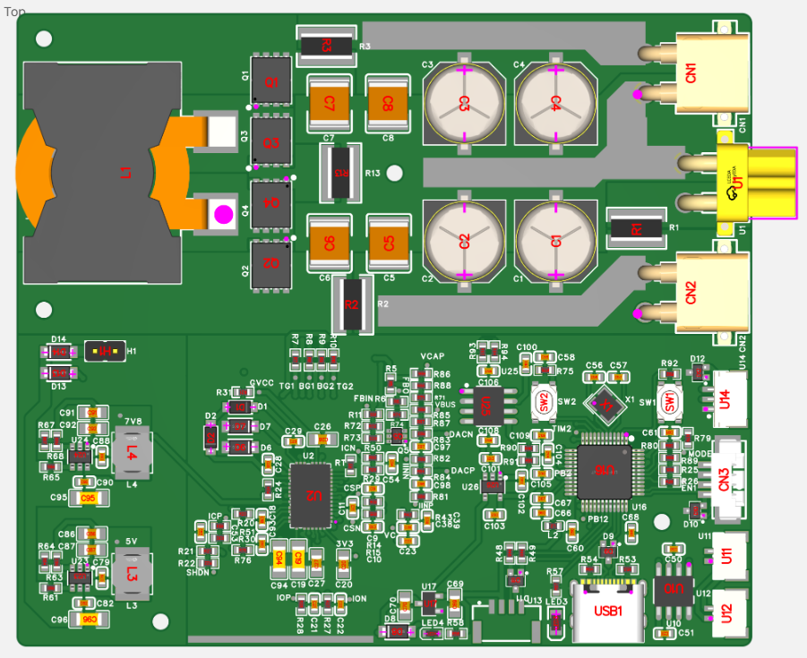
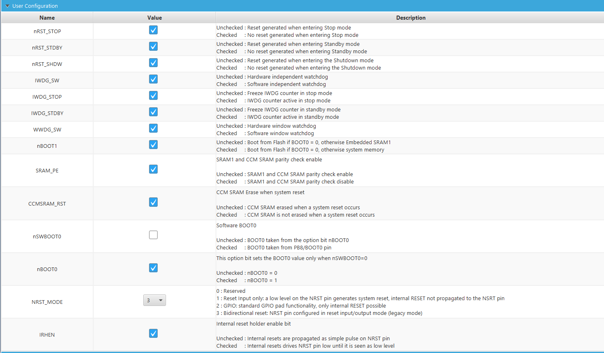
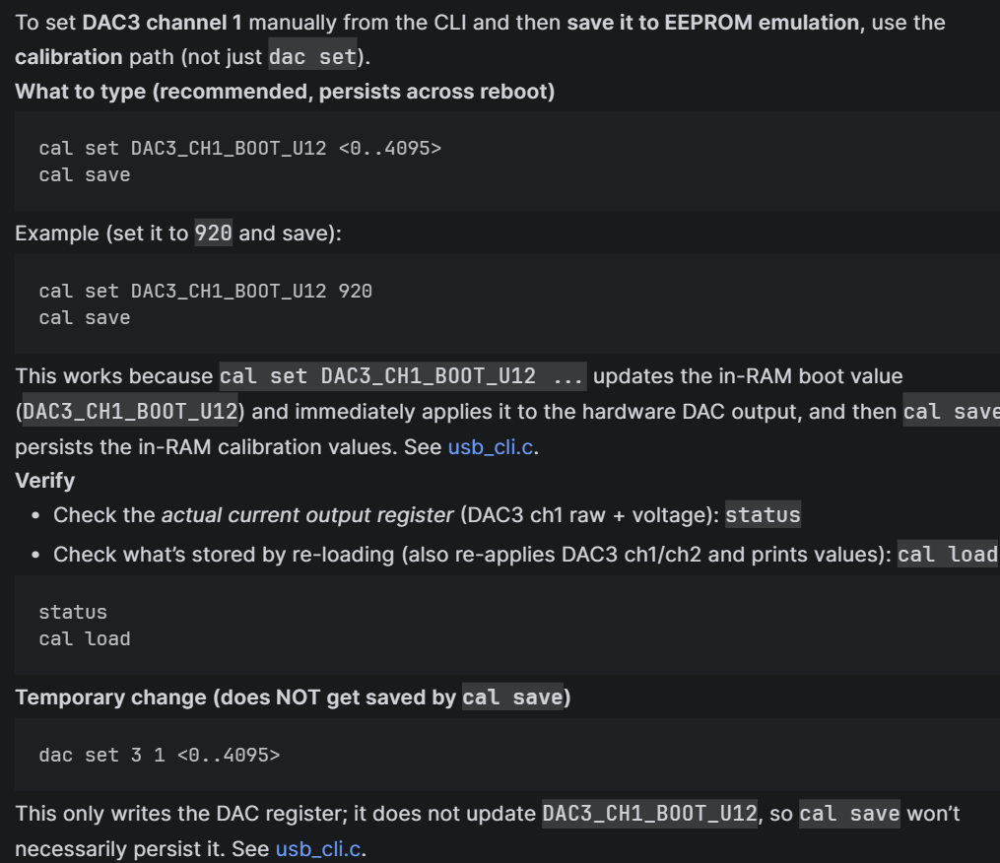

# RM8708A Supercapacitor controller

This is a Markdown snapshot of the public Notion page. The content has been
lightly normalized for readability, with embedded assets changed to stable
local paths.

## Pinout & Description



## Example Wiring Diagram (Bare Minimum)



## Mechanical files

- [3D_4loko_2026-02-15.step](../../3D_4loko_2026-02-15.step)

Note that H1 is DNP, just a placeholder.



## Hardware

- [EasyEDA Pro project: ProPrj_supercap v0.1_2026-02-15.epro](../../ProPrj_supercap%20v0.1_2026-02-15.epro)

NOTE: Download EasyEDA Pro to open, view and order.



Note: Project is PCBA ready, can be mass produced after testing is complete.

## Firmware

- [SCV2 GitHub repository](https://github.com/weiliangng/scv2)

Project has been configured for CLion; alternatively use CubeMX to generate
relevant config files for STM32CubeIDE.

Alternatively, directly flash the binary file using STM32CubeProgrammer (rename
to `.elf` extension) (untested).

- [Published firmware attachment](assets/test.elf)

## Programming

Before the flashed firmware will boot properly, you will need to program option
bytes using STM32CubeProgrammer. Use an ST-LINK with genuine STM32 chips (not
knockoffs; it is a gamble whether it works or not).

1. **Connect “Under reset” (not Hot plug).**
2. Set option bytes as follows (uncheck `nSWBOOT0`):



## Calibration

- [Calibration Script.ipynb](../../Calibration%20Script.ipynb)

Fully automatic calibrator: currently only supports calibrating IIN-related
constants.

NOTE: Skip the PMM, skip the capacitor bank, use **two half-charged batteries**
(otherwise you will hit voltage limiting at higher currents).

NOTE: Requires Jupyter Notebook (Anaconda installation recommended for least
friction).

### Calibrating supercapacitor-side output voltage limit (manual)

NOTE: Requires the PuTTY serial terminal executable (or any equivalent serial
terminal; Python also works).

Connect via a COM port. Find it in Device Manager, or plug/unplug and use
elimination. Baud rate does not matter.

On boot, you will see telemetry spam. To shut it off, type `telemetry off`, then
type `help` for the list of commands.

DAC3 OUT1 sets the capacitor-side output voltage, just like the old version uses
a potentiometer.

The default value is 920 and should result in around 26.4–26.2 V output voltage
in real life, depending on component tolerances.

To tune it, increment or decrement values slightly and measure the output with
the grey DMM (not more than 100).

Expected behavior:

- Decreasing DAC output voltage should increase output voltage.
- Increasing DAC output voltage should decrease output voltage.

Do the following:



## CAN API

Status packet:

```c
const uint32_t SCAP_STAT_ID = 0x077u; // SC status packets will have this ID; SC sends these packets

uint8_t data[8]; // Standard CAN packets: maximum 8 bytes

data[0] = (uint8_t)(v_bus_10mV & 0xFFu);
data[1] = (uint8_t)((v_bus_10mV >> 8) & 0xFFu); // Bus voltage in 10 mV increments
data[2] = (uint8_t)((uint16_t)i_load_10mA & 0xFFu);
data[3] = (uint8_t)(((uint16_t)i_load_10mA >> 8) & 0xFFu); // Chassis current in 10 mA increments
data[4] = (uint8_t)((uint16_t)i_conv_10mA & 0xFFu);
data[5] = (uint8_t)(((uint16_t)i_conv_10mA >> 8) & 0xFFu); // Target converter current in 10 mA increments
data[6] = capacity_pct; // Supercapacitor capacity percentage
data[7] = status_code;  // Reserved
```

Command packet:

```c
const uint32_t SCAP_CMD_ID = 0x067u; // SC command packets use this ID; SC listens to this ID
uint8_t data[8]; // Incoming packet

if (rxh.Identifier == SCAP_CMD_ID)
{
    const uint8_t settings = data[0]; // bit 0: enable or disable SWEN (other bits reserved)
    g_can_rx.can_power = (uint16_t)data[1] | ((uint16_t)data[2] << 8); // Alternate power limit if UART fails, in watts
    g_can_rx.can_buf = data[3]; // Alternate current-buffer energy if UART fails, in joules
```

The command snippet ends at that line on the source page.

## Pending tasks

- Check if six-layer performs significantly better than four-layer in terms of temperature and stability.
- Implement capacitor overcharge foldback protection in firmware.
- Implement Python calibration for other measurements (only IIN is calibrated for now).
- Test CAN functionality in the absence of UART.
- Test brownout option-byte functionality.
- Perform transient testing and compensation tuning in CV and CC modes.
- Reference: [TI SSZTCV2](assets/ti-ssztcv2.pdf).
- Finalize PCBA files and confirm parts availability (perform device standardization).
- Test with a real robot; wireless telemetry is highly recommended (ESP32).

## Extras

- Advanced: Draw up a game plan to measure and obtain Bode plots (may not be very feasible).
- [Dealing with high noise levels with a DIY injection transformer and PicoScope](https://www.eevblog.com/forum/projects/dealing-with-high-noise-levels-with-diy-injection-transformer-and-picoscope/)
- [DIY injection transformer for power-supply control-loop response measurements](https://www.eevblog.com/forum/projects/diy-injection-transformer-for-power-supply-control-loop-response-measurements/)
- Reference: [TI SNVA364A](assets/ti-snva364a.pdf).
- Advanced: Implement capacitance-measurement functionality.
- [How to measure very large capacitance](https://electronics.stackexchange.com/questions/387155/how-to-measure-very-large-capacitance-e-g-super-ultra-capacitors)
